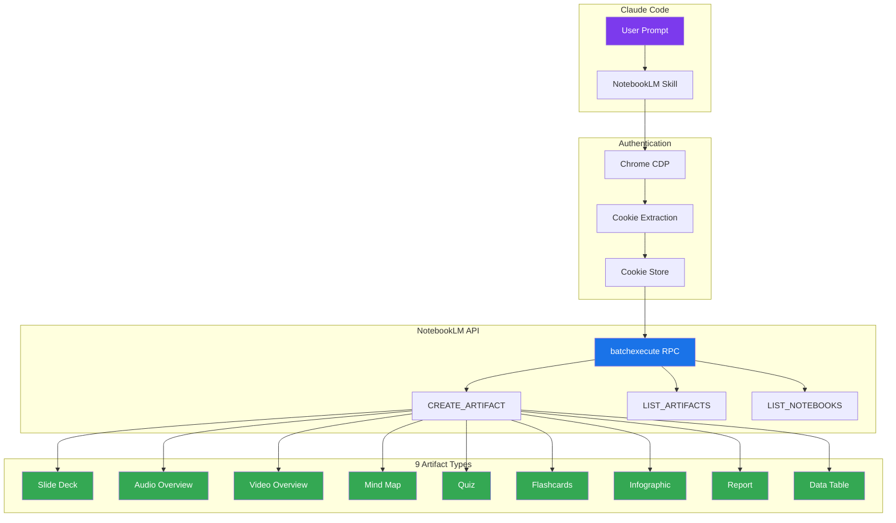
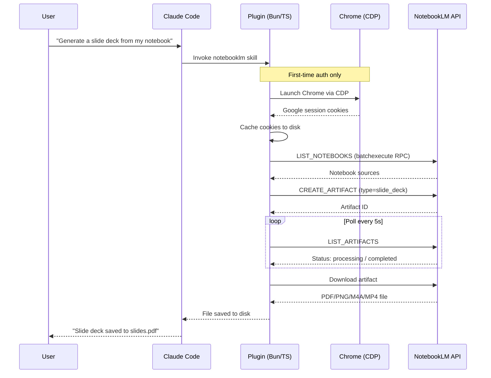

# NotebookLM AI Plugin

[](LICENSE)
[](https://code.claude.com/docs/en/plugins)
[](#supported-artifacts)
[](https://bun.sh)

**Bring the full Google NotebookLM experience to Claude Code.** Chat with your notebook AI, generate 9 types of artifacts, manage sources (URLs, YouTube, files), run fast/deep web research, and manage notes — just ask Claude.

---

## Quick Start

### Installation

#### Option 1: CLI Install (Recommended)

Use [npx skills](https://github.com/vercel-labs/skills) to install skills directly:

```bash
# Install the skill
npx skills add proyecto26/notebooklm-ai-plugin

# List available skills
npx skills add proyecto26/notebooklm-ai-plugin --list
```

This automatically installs to your `.claude/skills/` directory.

#### Option 2: Claude Code Plugin

Install via Claude Code's built-in plugin system:

```bash
# Add the marketplace
/plugin marketplace add proyecto26/notebooklm-ai-plugin

# Install the plugin
/plugin install notebooklm-ai-plugin
```

#### Option 3: Clone and Copy

Clone the repo and copy the skills folder:

```bash
git clone https://github.com/proyecto26/notebooklm-ai-plugin.git
cp -r notebooklm-ai-plugin/skills/* .claude/skills/
```

#### Option 4: Git Submodule

Add as a submodule for easy updates:

```bash
git submodule add https://github.com/proyecto26/notebooklm-ai-plugin.git .claude/notebooklm-ai-plugin
```

Then reference skills from `.claude/notebooklm-ai-plugin/skills/`.

#### Option 5: Fork and Customize

1. Fork this repository
2. Customize the skill for your specific needs
3. Clone your fork into your projects

### Authentication

The first time you use the skill, it opens Chrome for Google login. Cookies are cached for subsequent runs. Just tell Claude:

> *"Log me into NotebookLM"*

### Generate Your First Artifact

Once authenticated, just describe what you want:

> *"Add this notebook https://notebooklm.google.com/notebook/YOUR_ID and generate a study guide from it"*

That's it — the skill handles everything: authentication, notebook management, artifact creation, polling, and download.

---

## Features

### Chat with Notebook AI

Ask questions and get source-grounded answers with citations — the same AI chat experience from NotebookLM's web UI, now in your terminal.

### 9 Artifact Types

| Type | Output | Description |
|:-----|:-------|:------------|
| **Slide Deck** | PDF / PPTX | Presentation slides summarizing your notebook sources |
| **Audio Overview** | M4A | Podcast-style conversation (deep dive, brief, critique, debate) |
| **Video Overview** | MP4 | Animated explainer (classic, whiteboard, kawaii, anime, watercolor) |
| **Mind Map** | HTML | Interactive concept map of key topics and relationships |
| **Flashcards** | HTML / JSON | Study cards generated from source material |
| **Quiz** | HTML / JSON | Multiple-choice quiz with answer key and explanations |
| **Infographic** | PNG | Visual summary in landscape, portrait, or square orientation |
| **Report** | Markdown | Written report (briefing doc, study guide, blog post) |
| **Data Table** | CSV / Sheets | Structured data extracted from your sources |

### Source Management

Add and manage notebook sources directly from Claude Code — no need to switch to the browser.

- **URLs / Websites** — Add any web page as a source
- **YouTube** — Add video transcripts as sources
- **File Upload** — PDF, TXT, MD, DOCX, CSV, EPUB, images, audio, video
- **Pasted Text** — Add text content with a custom title
- **List / Delete** — View and manage existing sources

### Fast & Deep Research

Run web research that feeds directly into your notebook:

- **Fast Research** — Quick web search, finds relevant sources in seconds
- **Deep Research** — Comprehensive analysis with a full markdown report
- **Auto-Import** — Automatically add discovered sources to your notebook

### Notes Management

Create, update, and delete notes within your notebooks programmatically.

---

## Usage Examples

Just describe what you need to Claude — the skill triggers automatically:

**"What are the main findings in my NotebookLM notebook?"**
> Chats with the notebook AI and returns source-grounded answers with citations.

**"Add this YouTube video to my notebook: https://youtube.com/watch?v=..."**
> Adds the video transcript as a source to your active notebook.

**"Upload my research paper paper.pdf to the notebook and generate a study guide"**
> Uploads the file, then generates a markdown report in study guide format.

**"Run a deep research on 'AI agent frameworks 2026' and import the results"**
> Starts deep web research, waits for completion, and imports sources into the notebook.

**"Generate a slide deck from my NotebookLM notebook about machine learning"**
> Creates a PDF/PPTX presentation from your notebook sources.

**"Create a deep dive audio overview of my research papers"**
> Generates a long-form podcast-style M4A audio discussion.

**"Make a portrait infographic highlighting the key findings"**
> Produces a PNG infographic in portrait orientation.

**"Create a note called 'Key Takeaways' with a summary of the main points"**
> Creates a new note in the notebook with the specified content.

---

## Configuration

### Environment Variables

| Variable | Description |
|:---------|:------------|
| `NOTEBOOKLM_DATA_DIR` | Override data directory |
| `NOTEBOOKLM_COOKIE_PATH` | Custom cookie file path |
| `NOTEBOOKLM_CHROME_PROFILE_DIR` | Chrome profile directory |
| `NOTEBOOKLM_CHROME_PATH` | Chrome executable path |
| `NOTEBOOKLM_OUTPUT_DIR` | Default output directory |

### Rate Limits

NotebookLM free tier limits:

| Resource | Limit |
|:---------|:------|
| Audio / Video overviews | 3 per day |
| Reports / Flashcards / Quizzes | 10 per day |
| Daily chats | 50 |
| Total notebooks | 100 |
| Sources per notebook | 50 |

---

## Project Structure

```
notebooklm-ai-plugin/
├── .claude-plugin/
│   └── plugin.json                  # Plugin manifest
├── skills/
│   └── notebooklm/
│       ├── SKILL.md                 # Skill definition (triggers + docs)
│       └── scripts/                 # Implementation scripts (managed by the skill)
│           ├── main.ts              # CLI entry point
│           ├── auth.ts              # Chrome CDP authentication
│           ├── rpc-client.ts        # batchexecute protocol client
│           ├── artifact-generator.ts # Create / poll / download artifacts
│           ├── notebook-manager.ts  # Notebook library CRUD
│           └── ...                  # Cookie store, types, paths, RPC definitions
├── package.json
├── tsconfig.json
├── LICENSE
└── README.md
```

> For full CLI commands and script usage details, see [`skills/notebooklm/SKILL.md`](skills/notebooklm/SKILL.md).

---

## Architecture



**Hybrid approach:** Chrome DevTools Protocol (CDP) handles Google authentication once, then all operations use direct batchexecute RPC calls — no browser overhead for artifact generation.

### How It Works



### batchexecute RPC Protocol

The plugin communicates with NotebookLM via Google's internal batchexecute protocol — the same system used across Google web apps. Each operation maps to an obfuscated RPC method ID:

| Operation | RPC ID |
|:----------|:-------|
| List Notebooks | `wXbhsf` |
| Create Artifact | `R7cb6c` |
| List Artifacts | `gArtLc` |
| Generate Mind Map | `yyryJe` |
| Get Interactive HTML | `v9rmvd` |

All 9 artifact types (except Mind Map) use the unified `CREATE_ARTIFACT` RPC with different type codes. The plugin handles response parsing, error detection, and the anti-XSSI response format automatically.

### Cookie Management

Cookies are stored in a platform-aware location:

| Platform | Path |
|:---------|:-----|
| Windows | `%APPDATA%/notebooklm-ai/cookies.json` |
| macOS | `~/Library/Application Support/notebooklm-ai/cookies.json` |
| Linux | `~/.local/share/notebooklm-ai/cookies.json` |

The plugin captures **all Google domain cookies** (30+) via Chrome DevTools Protocol — this is required because Google's passive login check validates cookies beyond the standard auth set.

---

## Known Limitations

- **Audio / Video / Slides download:** These streaming media types are created successfully on NotebookLM's servers, but auto-download requires browser-level cookie handling. The plugin returns the artifact URL for manual browser download. Static media (infographics, reports) download automatically.
- **Data Table:** Parameter structure for type 9 artifacts is still being reverse-engineered.
- **RPC method IDs:** Google can change these at any time. If generation fails, check for updated IDs in the [notebooklm-sdk](https://github.com/agmmnn/notebooklm-sdk) project.

---

## Contributing

Contributions welcome! Key areas:

- **Playwright integration** for audio/video/slides download
- **Data Table** parameter structure fix
- **Mind Map** polling improvements
- **Tests** and CI/CD pipeline

---

## Credits

- [notebooklm-sdk](https://github.com/agmmnn/notebooklm-sdk) — TypeScript SDK reference for batchexecute protocol
- [notebooklm-kit](https://github.com/photon-hq/notebooklm-kit) — Artifact creation patterns
- [notebooklm-py](https://github.com/teng-lin/notebooklm-py) — Python RPC reference implementation
- [sherlock-ai-plugin](https://github.com/proyecto26/sherlock-ai-plugin) — CDP authentication patterns

---

## License

MIT - see [LICENSE](LICENSE)

---

<p align="center">
  Made with <b>Claude Code</b> by <a href="https://github.com/proyecto26">Proyecto 26</a>
</p>
